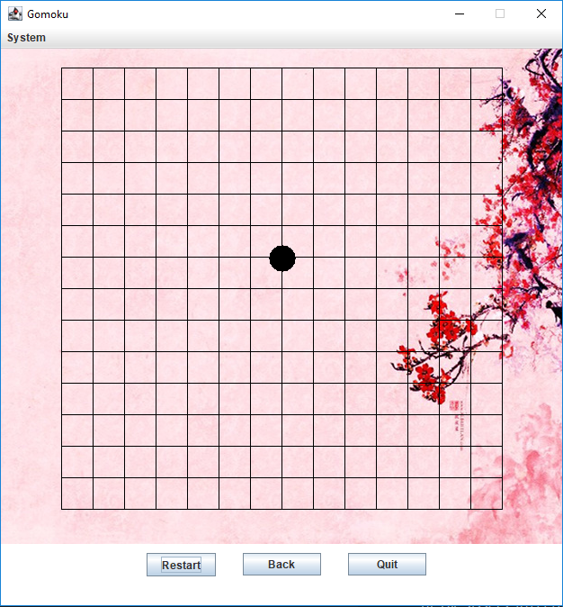

# GameGomokuGUI
## CS320 - WSU Vancouver
### Simple First Java\JavaX Paired Programming Project by Ron Cotton and Alex C.



## System Requirements
Recent JDK install is recommended,
**test requirements with the following commands**:
```
    java -version
    javac -version
````
*Last Tested on June 12th 2018 with Windows 10 running java 10.0.1*


## Compiling and Executing Game Gomoku
For Windows:
```
	build_run.bat
```

For most other OS's:
```
	./build_run.sh
```

## About

This is an implementation of a simple game GoBang or also known as Five-In-A-Row.  For more information about the game, see [Wikipedia: Gomoku](https://en.wikipedia.org/wiki/Gomoku).


The System Menu allows the user to both swap between three backgrounds in the assets directory and quitting the program.  Clicking the main game board initiates black to move first and alternate between white and black moves.  Three buttons below the game board either restarts the entire game, allows taking back individual moves, or exiting the game entirely.  GameGomokuGUI Window doesn't allow for resizing.

A very minimal implementation and an early assignment for the class.

## Note
*Original Git repo on WSU Vancouver ENCS Gitlab* - Sept 27, 2016

*Added scripts, moved files, added .gitignore, converted README to README.md, added screenshot* - June 12, 2018